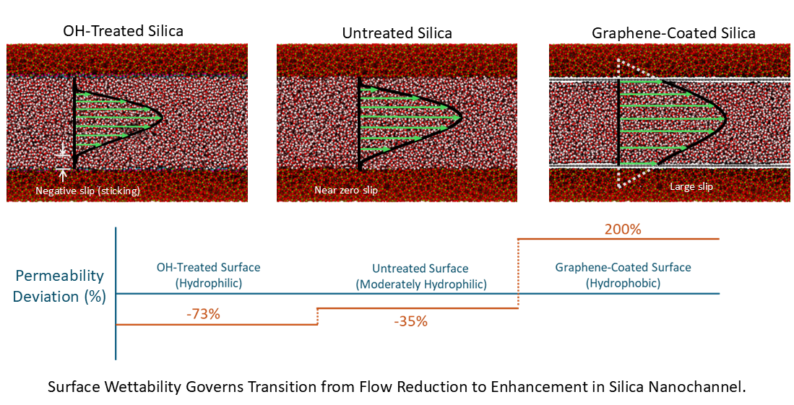
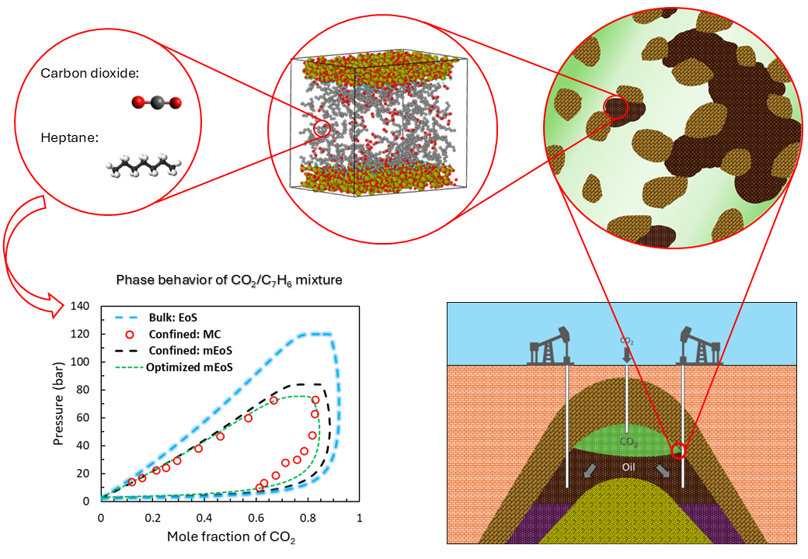
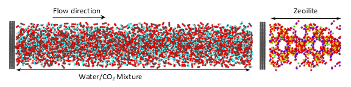
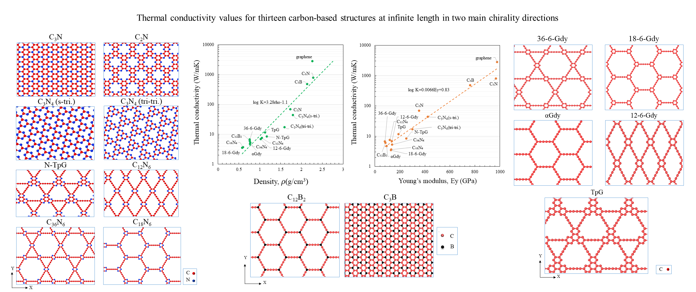
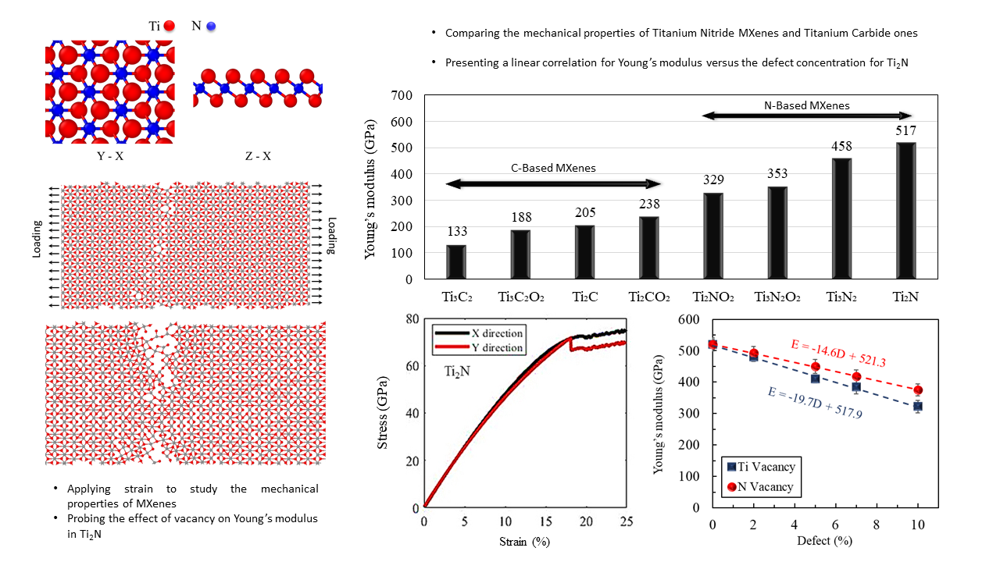
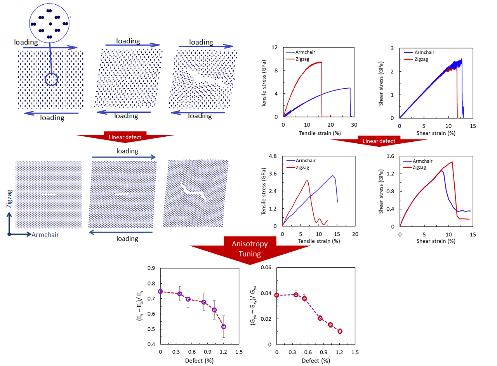
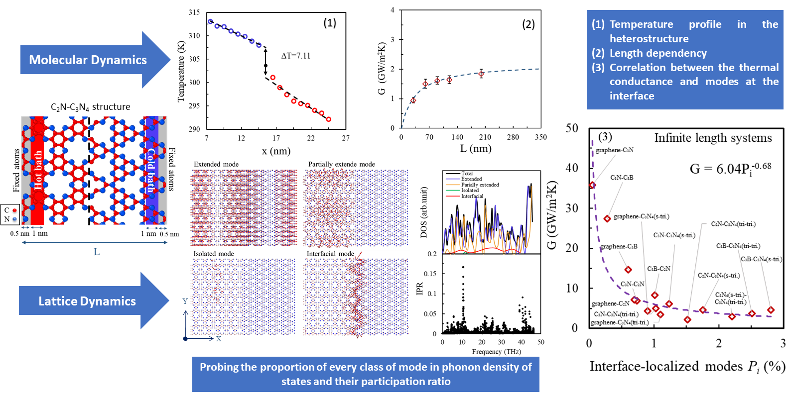

## Research Overview

My research focuses on molecular simulations of fluid transport and phase behavior in nanoconfined systems, with applications in energy systems, carbon storage, and advanced materials. I combine molecular dynamics, Monte Carlo methods, and thermodynamic modeling to study transport, adsorption, and equilibrium behavior at the nanoscale.

---

## Research Areas

### Water and CO₂ Transport in Nanochannels
Molecular dynamics simulations of nanoscale flow in silica nanochannels with varying surface chemistries. This work investigates deviations from classical continuum behavior and the role of interfacial interactions.

[Read more →](/miladhatamlee.github.io/research/nanochannel-flow/)

---

### Confined Phase Behavior of CO₂/Hydrocarbon Mixtures
Monte Carlo simulations and thermodynamic modeling of phase equilibrium under nanoscale confinement, including development of modified equations of state.

[Read more →](/miladhatamlee.github.io/research/confined-phase/)

---

### Adsorption and Transport in Zeolite 13X
Molecular simulation of CO₂ and water behavior in nanoporous materials, focusing on adsorption mechanisms and confined transport phenomena.

[Read more →](/miladhatamlee.github.io/research/zeolite-13x/)

---

### Graphene Polymorphs: Thermal and Mechanical Behavior
Thermal conductivity and the mechanical properties of graphene polymorphs and compounds: from C3N to graphdiyne lattices.

[Read more →](/miladhatamlee.github.io/research/2d-materials/)

---

### MXene Structures: Thermal and Mechanical Behavior
Probing the mechanical behaviors of titanium nitride and carbide MXenes employing  molecular dynamics simulation.

[Read more →](/miladhatamlee.github.io/research/2d-materials/)

---

### 2D Black Phosphorene: Thermal and Mechanical Behavior
Tuning shear mechanical properties and tensile strength anisotropy of monolayer black phosphorene using molecular dynamics simulations

[Read more →](/miladhatamlee.github.io/research/2d-materials/)

---

### 2D Heterostructures
Lattice-dynamics-based descriptors for the Interfacial Thermal Conductance (ITC) across 2D carbon-based nanostructures

[Read more →](/miladhatamlee.github.io/research/2d-materials/)
