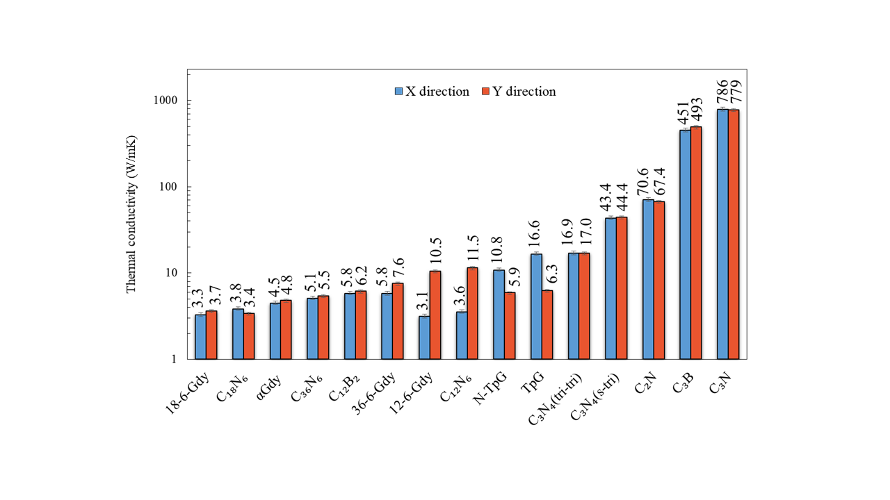
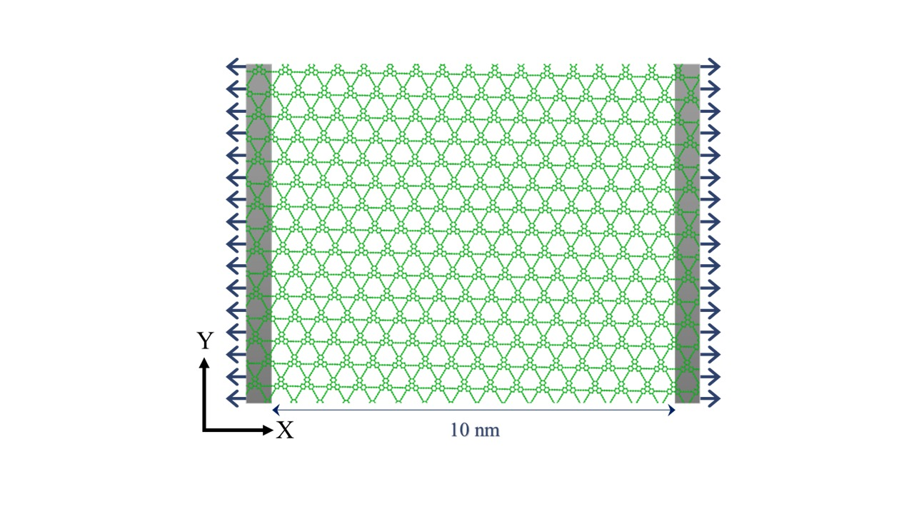
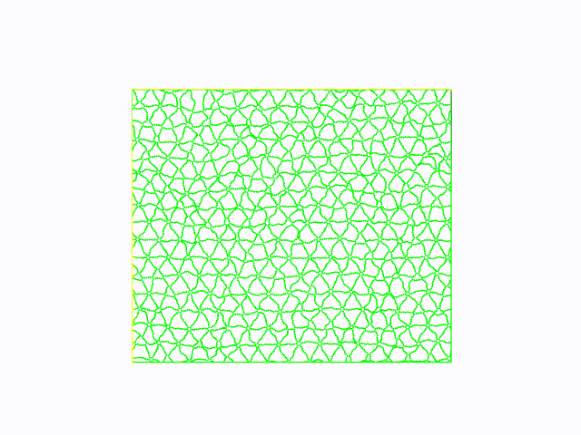

[← Back to Research]({{ '/research/' | relative_url }})

## Overview

This research focuses on understanding thermal transport and mechanical behavior in two-dimensional (2D) materials using molecular dynamics simulations. The work explores how atomic structure, bonding, and interfaces influence material properties at the nanoscale, with applications in nanoelectronics, thermal management, and advanced materials design.

---

## Graphene Polymorphs and Carbon-Based Structures

-Investigated thermal conductivity across various graphene-derived lattices
-Identified strong dependence of thermal transport on lattice structure and bonding
-Established structure–property relationships governing heat conduction​

    

---

## Related Publications

Hatam-Lee SM, Rajabpour A, Volz S. Thermal conductivity of graphene polymorphs and compounds: From C3N to graphdiyne lattices. Carbon. 2020 May 1;161:816-26.
